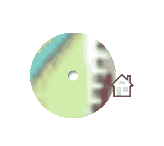

# SimpleMinimap

Simple minimap UI with markers, done in Unity 2017.4.9f1

To make it work:
-Drop CanvasMinimap.prefab into hierarchy window.

-If you need a camera there is one linked to the render texture called MinimapCamera.prefab.

-Remake the Marker.prefab as you wish.

-Link in the scrips with the necesary elements
